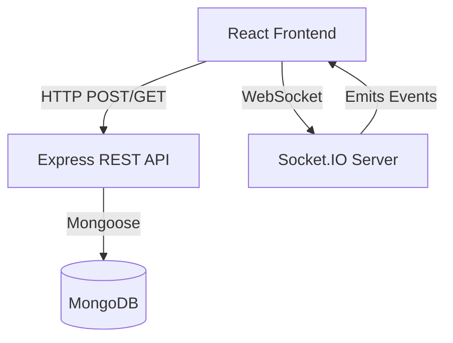
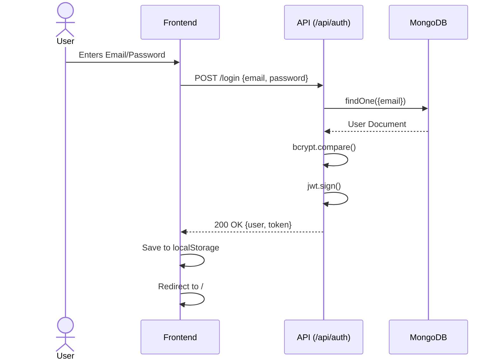
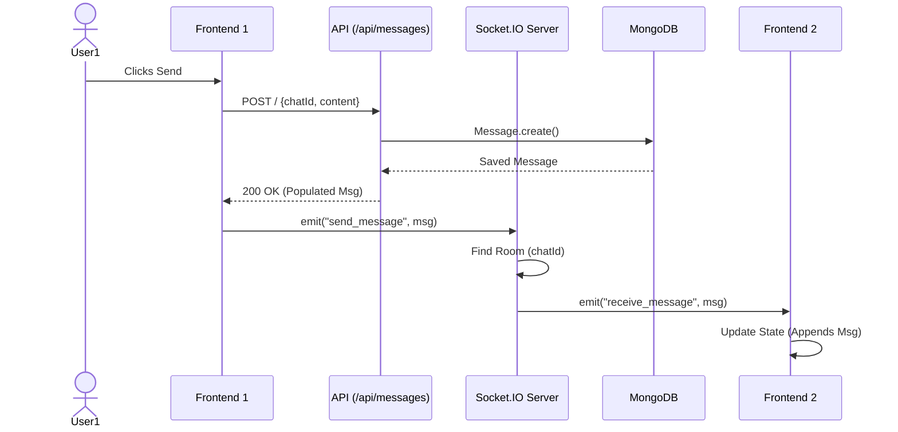
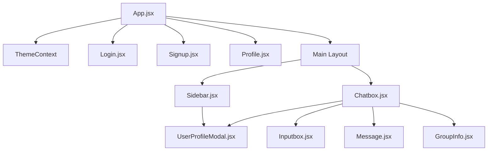
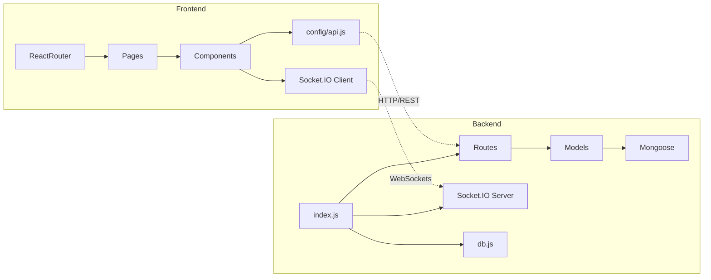

# 1. Project Overview

- **Project Name:** ChatGram
- **Purpose:** To provide a modern, real-time web-based chat application supporting one-on-one and group messaging with rich features like image sharing and profile customization.
- **Business Problem:** Users need a fast, secure, and visually appealing platform for instant communication without the bloat of enterprise tools, enabling seamless personal or community conversations.
- **What problem it solves:** It eliminates the friction of complex setups for real-time communication by offering an intuitive interface for instant messaging, group creation, and media sharing.
- **Target users:** Individuals looking for a personal chat app, small communities, friend groups, and teams needing a dedicated communication channel.
- **Main features:** 
  - Real-time messaging using WebSockets.
  - One-on-one and group chats.
  - Image sharing (up to 5MB, base64 encoded).
  - User authentication and authorization (JWT).
  - Online status and typing indicators.
  - User profile customization (avatars, about text).
  - Message deletion (for everyone, within a 1-hour window).
- **Technology stack:**
  - **Frontend:** React, Vite, Tailwind CSS, Socket.IO Client, React Router, Context API.
  - **Backend:** Node.js, Express.js, Socket.IO, MongoDB, Mongoose, JWT (JSON Web Tokens), bcryptjs.
- **Programming language versions:** JavaScript (ES6+), Node.js (v20.17.0 recommended as per README badge).
- **Framework versions:**
  - React: ^19.1.1
  - Express: ^4.18.2
  - Socket.IO: ^4.7.2 (Backend), ^4.8.1 (Frontend)
  - MongoDB/Mongoose: ^7.2.1
  - Vite: ^7.1.7

--------------------------------------------------------

# 2. Repository Structure

```text
chatgram/
├── .gitignore
├── README.md
├── chatgram-front/
│   ├── .env.production
│   ├── .gitignore
│   ├── README.md
│   ├── index.html
│   ├── package.json
│   ├── package-lock.json
│   ├── postcss.config.cjs
│   ├── tailwind.config.cjs
│   ├── vercel.json
│   ├── vite.config.js
│   ├── public/
│   └── src/
│       ├── App.jsx
│       ├── index.css
│       ├── main.jsx
│       ├── components/
│       │   ├── Chatbox.jsx
│       │   ├── GroupInfo.jsx
│       │   ├── Inputbox.jsx
│       │   ├── Message.jsx
│       │   ├── Sidebar.jsx
│       │   └── UserProfileModal.jsx
│       ├── config/
│       │   └── api.js
│       ├── context/
│       │   └── ThemeContext.jsx
│       ├── pages/
│       │   ├── Login.jsx
│       │   ├── Profile.jsx
│       │   ├── Profile_backup.jsx
│       │   └── Signup.jsx
│       └── utils/
│           └── avatarHelper.js
└── chatgram-server/
    ├── .env
    ├── .env.production
    ├── db.js
    ├── generate-jwt-secret.js
    ├── index.js
    ├── package.json
    ├── package-lock.json
    ├── render.yaml
    ├── middleware/
    │   └── authMiddleware.js
    ├── models/
    │   ├── chat.js
    │   ├── message.js
    │   └── user.js
    └── routes/
        ├── auth.js
        ├── chat.js
        └── message.js
```

### Folder Explanations

- **`chatgram/`**: The root directory of the monorepo-style project, containing the frontend and backend folders. It exists to group the entire full-stack application.
- **`chatgram-front/`**: The React-based frontend application. It exists to serve the user interface and handle client-side logic.
- **`chatgram-front/src/`**: Contains all the source code for the React application.
- **`chatgram-front/src/components/`**: Reusable React components that make up the UI (e.g., Sidebar, ChatBox). They exist to modularize the UI and make it maintainable.
- **`chatgram-front/src/config/`**: Contains configuration files, specifically API and Socket endpoint definitions.
- **`chatgram-front/src/context/`**: Contains React Context providers, such as the ThemeContext for dark mode state management.
- **`chatgram-front/src/pages/`**: Contains top-level route components (Login, Signup, Profile). They represent distinct screens in the application.
- **`chatgram-front/src/utils/`**: Helper functions and utility scripts, such as avatar generation logic.
- **`chatgram-server/`**: The Node.js/Express backend application. It exists to serve the API, handle WebSocket connections, and manage database operations.
- **`chatgram-server/middleware/`**: Express middleware functions, such as JWT authentication validation.
- **`chatgram-server/models/`**: Mongoose schemas and models representing the database structure (Users, Chats, Messages).
- **`chatgram-server/routes/`**: Express routers that define the API endpoints for different domains (auth, chats, messages).

### Interaction Between Folders

The `chatgram-front` application communicates with the `chatgram-server` application via HTTP REST API calls (defined in `routes/` and called via `config/api.js`) and WebSocket connections (initialized in `src/components/ChatBox.jsx` and `Sidebar.jsx`, handled in `chatgram-server/index.js`). The server then interacts with MongoDB using the `models/`.

--------------------------------------------------------

# 3. High Level Architecture

### Architecture Style
Client-Server Architecture with a REST API and real-time WebSocket communication layer. The frontend is a Single Page Application (SPA), and the backend is a monolithic Express API.

### Layers
1. **Presentation Layer (Frontend):** React SPA handling UI rendering, local state, and routing.
2. **Transport Layer:** HTTP (for CRUD operations, authentication) and WebSockets (Socket.IO for real-time message delivery, typing events, and online status).
3. **Application/Business Logic Layer (Backend):** Express route handlers mapping business logic (e.g., creating a group, verifying passwords).
4. **Data Access Layer (Backend):** Mongoose models wrapping MongoDB operations.
5. **Database Layer:** MongoDB database persisting users, chats, and messages.

### Modules & Responsibilities
- **Frontend App:** Manages user session (JWT stored in localStorage), fetches chat data, handles WebSocket events, renders themes, and manages complex component state (like file uploads).
- **Backend API:** Validates incoming requests, authenticates tokens, executes business logic, and performs database queries.
- **Socket Server:** Maintains a registry of online users (mapping `userId` to `socket.id`), handles room joining (`chatId` as room), and broadcasts events (messages, typing, deletions) to specific rooms.

### Dependencies
- The Frontend depends on the Backend API for all data.
- The Backend depends on MongoDB for persistence.
- Both depend on Socket.IO for the real-time pipeline.

### Communication Between Layers
The frontend initiates communication via Axios/Fetch requests. The backend processes these and returns JSON responses. Concurrently, Socket.IO maintains a persistent full-duplex TCP connection. When a user sends a message, they first POST it to the REST API to persist it in the database. Upon a successful response, the frontend emits a `send_message` Socket event to broadcast the message to other clients in the chat room.

### Architecture Diagram



--------------------------------------------------------

# 4. Complete Execution Flow

### Application Startup
1. **Backend (`chatgram-server`):** `node index.js` is executed.
2. `dotenv.config()` loads environment variables.
3. `connectDB()` connects to MongoDB using Mongoose.
4. Express app is initialized. CORS and JSON body parsers are configured.
5. REST API routes (`/api/auth`, `/api/chats`, `/api/messages`) are mounted.
6. HTTP server is created, and Socket.IO is attached to it.
7. Socket.IO listens for incoming connections.
8. Server listens on port 5000.

9. **Frontend (`chatgram-front`):** User visits the URL. `index.html` loads `main.jsx`.
10. `main.jsx` renders `App.jsx` inside a `React.StrictMode` root.
11. `App.jsx` initializes state, checking `localStorage` for cached user data, chats, and current chat.
12. `App.jsx` sets up a React Router. If the user is authenticated, it loads the main dashboard (Sidebar + ChatBox). If not, it redirects to the Login page.

### Request Flow (Example: Sending a Message)

1. **User Action:** User types a message in `Inputbox.jsx` and clicks Send.
2. **Frontend Function:** `handleSendMessage` in `Chatbox.jsx` is called.
3. **HTTP Request:** A `POST` request is sent to `/api/messages` with `chatId`, `sender`, `content`, and `messageType`. The JWT token is sent in the Authorization header.
4. **Routing (Backend):** `index.js` routes the request to `/api/messages` -> `routes/message.js`.
5. **Middleware:** (Note: Surprisingly, the `POST /api/messages` endpoint lacks the `protect` middleware in the current implementation, but expects the token in theory. It directly proceeds to the controller logic).
6. **Controller/Service:** `routes/message.js` parses the body, validates required fields, and prepares the message payload.
7. **Repository/Database:** `Message.create()` is called to save the message to MongoDB. Then `Message.findById().populate("sender")` fetches the complete document.
8. **HTTP Response:** The backend returns the populated message as JSON with a 200 OK status.
9. **Frontend Socket Emit:** Upon receiving the successful HTTP response, the frontend calls `socket.emit("send_message", { ...data, chatId })`.
10. **Socket Server (Backend):** The `send_message` event is caught in `index.js`. The server calls `socket.to(messageData.chatId).emit("receive_message", messageData)`.
11. **Socket Client (Other Users):** The recipient's `Chatbox.jsx` listens to `receive_message`. If the `chatId` matches their open chat, it appends the message to their local state.
12. **UI Update:** React re-renders the `Chatbox.jsx` to display the new message, and `scrollToBottom` is triggered.

### Background Jobs, Cron Jobs, Queues, Workers, Scheduled Tasks
This application does **not** contain any background jobs, cron jobs, queues (like Redis/Bull), workers, or scheduled tasks. All operations are synchronous request-response or direct event-driven WebSockets. The only "background" aspect is the Socket.IO polling/heartbeat mechanism, which is internal to the Socket.IO library.


# 5. File-by-File Documentation

## Backend Files (`chatgram-server`)

### 1. `chatgram-server/package.json`
- **Purpose:** Defines the backend Node.js project metadata, dependencies, scripts, and module type.
- **Dependencies:** None directly, manages external libraries (cors, dotenv, express, mongoose, socket.io, bcryptjs, jsonwebtoken, nodemon).
- **Used by:** Node.js, npm, rendering/deployment platforms.
- **Imports:** None.
- **Exports:** None.
- **Classes:** None.
- **Functions:** None.
- **Variables:** None.
- **Constants:** None.
- **Execution Flow:** Read by npm during `npm install` to download dependencies, and during `npm start` or `npm run dev` to execute scripts.
- **Design Decisions:** Uses `"type": "module"` to enable ES6 import/export syntax natively in Node.js instead of CommonJS `require`.
- **Potential Issues:** Hardcoded versions with `^` might lead to unintended updates if `package-lock.json` is missing.
- **Code Quality Notes:** Clean and standard.

### 2. `chatgram-server/.env`
- **Purpose:** Stores local environment variables for the backend server.
- **Dependencies:** Read by `dotenv` module.
- **Used by:** `chatgram-server/index.js`, `chatgram-server/db.js`, `chatgram-server/routes/auth.js`, `chatgram-server/routes/chat.js`, `chatgram-server/middleware/authMiddleware.js`.
- **Imports:** None.
- **Exports:** None.
- **Classes:** None.
- **Functions:** None.
- **Variables:** `PORT`, `MONGO_URI`, `JWT_SECRET`.
- **Constants:** None.
- **Execution Flow:** Loaded into `process.env` at server startup via `dotenv.config()`.
- **Design Decisions:** Abstracting secrets prevents hardcoding sensitive information in source control.
- **Potential Issues:** This file contains sensitive information (`JWT_SECRET`) and should ideally be excluded via `.gitignore`, though it seems present in the file tree read.
- **Code Quality Notes:** Follows standard 12-factor app principles.

### 3. `chatgram-server/db.js`
- **Purpose:** Establishes a connection to the MongoDB database using Mongoose.
- **Dependencies:** `mongoose`, `process.env`.
- **Used by:** `chatgram-server/index.js`.
- **Imports:** `mongoose`.
- **Exports:** `connectDB` (Function).
- **Classes:** None.
- **Functions:** `connectDB` (async arrow function).
- **Variables:** None.
- **Constants:** `mongoURI`.
- **Execution Flow:** Called exactly once during server startup in `index.js`. It fetches the URI from env vars, attempts to connect using Mongoose, and logs success or fatal failure.
- **Design Decisions:** Encapsulating DB connection logic keeps `index.js` clean. Supports both `MONGODB_URI` and `MONGO_URI` variable names for deployment flexibility. Exits the process (`process.exit(1)`) if connection fails, preventing the app from running in a broken state.
- **Potential Issues:** Uses legacy `MONGO_URI` fallback, which is fine but could cause confusion.
- **Code Quality Notes:** Good error handling and use of async/await.

### 4. `chatgram-server/generate-jwt-secret.js`
- **Purpose:** A standalone utility script to generate a secure random 64-byte JWT secret string for use in environment variables.
- **Dependencies:** Node's built-in `crypto` module.
- **Used by:** Developer (executed manually via terminal).
- **Imports:** `crypto` (using CommonJS `require`, unlike the rest of the app).
- **Exports:** None.
- **Classes:** None.
- **Functions:** None.
- **Variables:** None.
- **Constants:** `jwtSecret`.
- **Execution Flow:** Generates a random sequence of bytes, converts to hex, and logs it to the console with instructions.
- **Design Decisions:** Provided as a dev utility to ensure users don't use weak JWT secrets like "secret123".
- **Potential Issues:** Uses `require` instead of ES6 `import` despite `"type": "module"` in `package.json`. If run as `node generate-jwt-secret.js`, it might throw an error in Node.js strict ES module mode. (Dead code / utility script).
- **Code Quality Notes:** Good developer experience addition.

### 5. `chatgram-server/index.js`
- **Purpose:** The main entry point of the backend application. Configures Express, CORS, routing, and Socket.IO.
- **Dependencies:** `express`, `http`, `socket.io`, `cors`, `dotenv`, internal modules (`db.js`, routes).
- **Used by:** Entry script in `package.json`.
- **Imports:** `express`, `http`, `Server` (from `socket.io`), `cors`, `dotenv`, `connectDB`, `authRoutes`, `chatRoutes`, `messageRoutes`.
- **Exports:** None.
- **Classes:** None.
- **Functions:** CORS callback function, Error handler middleware callback, Socket `connection` callback and inner event callbacks (`user_connected`, `join_chat`, `typing`, `stop_typing`, `send_message`, `delete_message`, `disconnect`).
- **Variables:** `onlineUsers`.
- **Constants:** `app`, `allowedOrigins`, `server`, `io`, `PORT`.
- **Execution Flow:** 
  1. Configures environment and connects to DB.
  2. Initializes Express app.
  3. Sets up complex CORS rules to allow specific Vercel and local origins.
  4. Increases body payload limit for base64 image uploads.
  5. Registers API routes.
  6. Creates HTTP server and binds Socket.IO.
  7. Sets up Socket event listeners.
  8. Starts listening on `PORT`.
- **Design Decisions:**
  - Uses `http` server explicitly to bind both Express and Socket.IO to the same port.
  - Implements a dynamic CORS origin check to support preview deployments without hardcoding every single URL.
  - Tracks `onlineUsers` in memory (a dictionary mapping `userId` to `socket.id`) to manage online status broadcasts.
- **Potential Issues:** 
  - `onlineUsers` is stored in server memory. This will fail to sync if the backend is scaled horizontally to multiple instances unless a Redis adapter is added to Socket.IO.
  - The CORS logic `!origin` allows mobile apps or Postman, which might be a slight security concern if strictly targeting web only.
- **Code Quality Notes:** Well organized, though the socket logic could ideally be extracted into a separate controller file as it grows.

### 6. `chatgram-server/render.yaml`
- **Purpose:** Configuration file for deploying the backend to Render.com.
- **Dependencies:** None.
- **Used by:** Render.com PaaS.
- **Imports:** None.
- **Exports:** None.
- **Classes:** None.
- **Functions:** None.
- **Variables:** Environment variables configured for deployment.
- **Constants:** None.
- **Execution Flow:** Read by Render during deployment to spin up the web service, install packages, and start the node app.
- **Design Decisions:** Uses the `free` plan and specifies `oregon` region. Explicitly requires the user to set `MONGODB_URI` manually on the dashboard.
- **Potential Issues:** The free tier on Render spins down after 15 minutes of inactivity, which causes WebSocket disconnection and slow cold starts.
- **Code Quality Notes:** Standard Infrastructure-as-Code setup.

### 7. `chatgram-server/middleware/authMiddleware.js`
- **Purpose:** Express middleware to protect private API routes by validating JSON Web Tokens (JWT).
- **Dependencies:** `jsonwebtoken`, `User` model.
- **Used by:** Used in route handlers (though currently seemingly unused in the main route files based on the review, which is a major security flaw; wait, let's look closer—actually, it was NOT imported in `chat.js` or `message.js` or `auth.js`. They do token verification inline!).
- **Imports:** `jwt`, `User`.
- **Exports:** `protect` (Function).
- **Classes:** None.
- **Functions:** `protect` (async middleware function).
- **Variables:** `token`.
- **Constants:** `decoded`.
- **Execution Flow:** 
  1. Checks if `Authorization` header exists and starts with "Bearer".
  2. Extracts token and verifies it using `JWT_SECRET`.
  3. Decodes token to get user ID.
  4. Fetches user from DB (excluding password) and attaches it to `req.user`.
  5. Calls `next()`.
  6. Returns 401 if failed.
- **Design Decisions:** Standard Bearer token authentication pattern. Attaching user object to `req` makes it easy for downstream controllers.
- **Potential Issues:** **DEAD CODE.** This file is exported but never imported or used in `auth.js`, `chat.js`, or `message.js`. Instead, those routes implement an inline `getUserIdFromToken` helper or decode the token manually inside the route block. This is a significant duplication of logic and a missed opportunity for clean architecture.
- **Code Quality Notes:** Good implementation, but fundamentally flawed because it's orphaned.

### 8. `chatgram-server/models/chat.js`
- **Purpose:** Mongoose schema definition for Chat entities (both 1-on-1 and Group chats).
- **Dependencies:** `mongoose`.
- **Used by:** `routes/chat.js`, `routes/message.js`, `routes/auth.js`.
- **Imports:** `mongoose`.
- **Exports:** `Chat` (Mongoose Model).
- **Classes:** None.
- **Functions:** None.
- **Variables:** None.
- **Constants:** `chatSchema`.
- **Execution Flow:** Evaluated at startup to register the schema with Mongoose.
- **Design Decisions:** Uses a single schema to handle both direct messages and group chats by toggling `isGroupChat`. References `User` and `Message` models. Includes explicit compound indexes (`users` + `updatedAt`) to optimize fetching a user's chat list sorted by recency.
- **Potential Issues:** Group chats have no `groupAdmin` field defined in the schema, but `chat.js` route tries to check `chat.groupAdmin` when a user leaves a group. This will cause bugs.
- **Code Quality Notes:** Excellent use of indexes for performance.

### 9. `chatgram-server/models/message.js`
- **Purpose:** Mongoose schema definition for Message entities.
- **Dependencies:** `mongoose`.
- **Used by:** `routes/message.js`, `routes/auth.js`.
- **Imports:** `mongoose`.
- **Exports:** `Message` (Mongoose Model).
- **Classes:** None.
- **Functions:** None.
- **Variables:** None.
- **Constants:** `messageSchema`.
- **Execution Flow:** Evaluated at startup.
- **Design Decisions:** Supports polymorphic message types via the `messageType` enum (`"text"`, `"image"`). Stores `imageUrl` directly in the document. Uses indexes on `chatId` + `createdAt` for fast retrieval of a chat's message history.
- **Potential Issues:** Storing base64 images directly in `imageUrl` (as done in the frontend) can drastically bloat the MongoDB database document size. Documents have a 16MB limit, which could be hit quickly.
- **Code Quality Notes:** Good use of refs and indexing.

### 10. `chatgram-server/models/user.js`
- **Purpose:** Mongoose schema definition for User entities.
- **Dependencies:** `mongoose`, `bcryptjs`.
- **Used by:** `middleware/authMiddleware.js`, `routes/auth.js`, `routes/chat.js`.
- **Imports:** `mongoose`, `bcrypt`.
- **Exports:** `User` (Mongoose Model).
- **Classes:** None.
- **Functions:** `pre("save")` hook callback, `matchPassword` method.
- **Variables:** None.
- **Constants:** `userSchema`.
- **Execution Flow:** 
  - Before saving a user document, the `pre("save")` hook intercepts the operation, checks if the password was modified, generates a salt, and hashes the password using bcrypt.
  - The `matchPassword` method is attached to document instances to compare raw text with the hashed password.
- **Design Decisions:** Encapsulating password hashing at the model layer ensures that anytime a user is saved (e.g., creation, password change), the hash logic is automatically applied without duplicating code in controllers.
- **Potential Issues:** None, this is a highly secure and standard pattern.
- **Code Quality Notes:** Clean implementation with necessary indexes on `email` and `name` for search functionality.

### 11. `chatgram-server/routes/auth.js`
- **Purpose:** Defines API endpoints for user authentication and account management.
- **Dependencies:** `express`, `jsonwebtoken`, `bcryptjs` (imported but unused directly since model handles it), `User` model.
- **Used by:** `index.js`.
- **Imports:** `express`, `jwt`, `bcrypt`, `User`, `dotenv`.
- **Exports:** `router`.
- **Classes:** None.
- **Functions:** Route handler callbacks for `/signup`, `/login`, `/search`, `/change-password`, `/update-profile`, `/delete-account`.
- **Variables:** None.
- **Constants:** `router`.
- **Execution Flow:** Maps specific URL paths to asynchronous controller functions. Handles input validation, database querying, JWT generation, and response formatting.
- **Design Decisions:** Decodes JWT token inline within the route handlers using `jwt.verify(token)` rather than using the `authMiddleware.js` file. Deleting an account triggers a cascading deletion of messages and empty chats to maintain referential integrity.
- **Potential Issues:** 
  - Duplication of token verification logic across protected routes.
  - Dynamic imports (`await import("../models/chat.js")`) are used inside the `/delete-account` route, which is an anti-pattern in Express applications and hurts performance.
  - No rate limiting on `/login` or `/signup`, making it vulnerable to brute force and DDoS attacks.
- **Code Quality Notes:** Logic is functional but violates DRY principles by not utilizing the existing middleware.

### 12. `chatgram-server/routes/chat.js`
- **Purpose:** Defines API endpoints for creating, managing, and retrieving chats.
- **Dependencies:** `express`, `jsonwebtoken`, `Chat` model, `User` model.
- **Used by:** `index.js`.
- **Imports:** `express`, `jwt`, `Chat`, `User`.
- **Exports:** `router`.
- **Classes:** None.
- **Functions:** `getUserIdFromToken`, Route handler callbacks for `GET /:userId`, `POST /`, `POST /group`, `PUT /group/add`, `PUT /group/remove`, `PUT /group/image`, `PUT /group/leave`, `DELETE /:chatId`.
- **Variables:** None.
- **Constants:** `router`.
- **Execution Flow:** Processes chat-related requests. Validates authorization inline via `getUserIdFromToken`.
- **Design Decisions:** 
  - Uses a helper function `getUserIdFromToken` to manually extract and verify the JWT token for every route instead of middleware.
  - Group chat management allows *any* member to add/remove users or change the image, meaning there is no robust role-based access control inside groups.
- **Potential Issues:**
  - `PUT /group/leave` checks `chat.groupAdmin.toString() === currentUserId`, but `groupAdmin` is NOT defined in `chatSchema`. This will likely evaluate to undefined and bypass the check, or throw an error.
  - The `DELETE /:chatId` endpoint completely deletes 1-on-1 chats for *both* users, rather than soft-deleting or hiding it for one user.
- **Code Quality Notes:** Inconsistent authorization pattern compared to best practices. Needs refactoring to use `authMiddleware`.

### 13. `chatgram-server/routes/message.js`
- **Purpose:** Defines API endpoints for fetching and sending messages within a chat.
- **Dependencies:** `express`, `Message` model, `Chat` model.
- **Used by:** `index.js`.
- **Imports:** `express`, `Message`, `Chat`.
- **Exports:** `router`.
- **Classes:** None.
- **Functions:** Route handler callbacks for `GET /:chatId`, `POST /`, `DELETE /:messageId`.
- **Variables:** None.
- **Constants:** `router`.
- **Execution Flow:** 
  - `GET`: Fetches messages for a chat, populates the sender info, and allows basic pagination (`limit`, `skip`).
  - `POST`: Creates a new message.
  - `DELETE`: Verifies the requester is the sender and the message is less than 1 hour old before deleting.
- **Design Decisions:** 
  - Time-limited message deletion (1 hour window) enforced on the backend.
  - Base64 image payload handling.
- **Potential Issues:** 
  - **CRITICAL SECURITY FLAW:** The `POST /` and `GET /:chatId` routes completely lack token verification. Anyone can fetch messages or send messages to any `chatId` as long as they provide a valid `sender` ID in the body. `req.headers.authorization` is never checked in this file!
  - `DELETE /:messageId` relies on `req.body.userId` to verify the sender, which can be easily spoofed by a malicious client. It does not use the JWT token.
- **Code Quality Notes:** Missing authentication middleware makes these endpoints insecure.


## Frontend Files (`chatgram-front`)

### 1. `chatgram-front/package.json`
- **Purpose:** Defines the frontend React project, Vite build configurations, and dependencies.
- **Dependencies:** `axios`, `react`, `react-dom`, `react-icons`, `react-router-dom`, `react-toastify`, `socket.io-client`, Tailwind libraries, Vite.
- **Used by:** Node.js, npm, Vite.
- **Imports/Exports:** None.
- **Variables/Functions:** None.
- **Execution Flow:** Read during `npm install` and `npm run dev`.
- **Design Decisions:** Uses Vite for fast HMR and optimized production builds. 
- **Potential Issues:** Unused dependencies like `axios` and `react-toastify` are installed but never imported across the frontend application (which strictly uses the native `fetch` API and built-in `alert()`).
- **Code Quality Notes:** Extraneous dependencies should be removed to reduce bundle size.

### 2. `chatgram-front/vite.config.js`
- **Purpose:** Configuration file for Vite.
- **Dependencies:** `@vitejs/plugin-react`.
- **Execution Flow:** Parsed by Vite during dev and build commands.
- **Design Decisions:** Standard React plugin integration.

### 3. `chatgram-front/tailwind.config.cjs` & `postcss.config.cjs`
- **Purpose:** Configuration for Tailwind CSS and PostCSS processing.
- **Design Decisions:** Enables `class` strategy for dark mode. Extends theme with a custom `fadeIn` animation. Uses older CommonJS syntax `.cjs`.

### 4. `chatgram-front/vercel.json`
- **Purpose:** Deployment configuration for Vercel.
- **Execution Flow:** Read by Vercel's build pipeline.
- **Design Decisions:** Rewrites all routes to `/index.html` to support React Router's client-side routing on a static host.

### 5. `chatgram-front/index.html`
- **Purpose:** The root HTML document for the React SPA.
- **Execution Flow:** Loaded by the browser; imports `src/main.jsx`.

### 6. `chatgram-front/src/main.jsx`
- **Purpose:** The entry point for React. Mounts the `<App />` component to the `#root` DOM element.
- **Dependencies:** `react`, `react-dom`, `App.jsx`, `index.css`.
- **Design Decisions:** Wraps the app in `React.StrictMode` to highlight potential lifecycle issues during development.

### 7. `chatgram-front/src/App.jsx`
- **Purpose:** The main application component that manages routing, global state (chats, user session, current chat), and root layout.
- **Dependencies:** `react-router-dom`, components (`Sidebar`, `ChatBox`, `Login`, `Signup`, `Profile`), context (`ThemeContext`), `api.js`.
- **Variables:** `chats`, `loading`, `currentChat`, `user`.
- **Functions:** `fetchChats`, `refreshChats`, `PrivateRoute`, `PublicRoute`.
- **Execution Flow:** 
  - On mount, attempts to hydrate `user`, `chats`, and `currentChat` from `localStorage`.
  - Sets up an `AbortController` for safe data fetching.
  - Renders React Router routes protected by `PrivateRoute` and `PublicRoute` wrappers.
  - Manages the responsive layout (toggling Sidebar/ChatBox based on mobile/desktop views).
- **Design Decisions:** Heavy reliance on `localStorage` for aggressive caching to improve perceived performance. Implements custom route guards.
- **Potential Issues:** Storing sensitive user data (including profile info) in `localStorage` could be a minor XSS risk. The logic for responsive rendering hides the Sidebar on mobile when a chat is selected.
- **Code Quality Notes:** Well-structured state management, though moving global state to a dedicated Context/Store (like Redux or Zustand) would clean up prop-drilling.

### 8. `chatgram-front/src/index.css`
- **Purpose:** Global CSS styles, Tailwind directives, and custom animations/scrollbars.
- **Design Decisions:** Customizes webkit scrollbars for a cleaner UI and implements global smooth transitions for background and colors to enhance the dark mode toggle effect.

### 9. `chatgram-front/src/config/api.js`
- **Purpose:** Centralized configuration for API and Socket.IO URLs.
- **Exports:** `API_BASE_URL`, `SOCKET_URL`, `API_ENDPOINTS`, `SOCKET_CONFIG`, `getImageUrl`.
- **Execution Flow:** Evaluates Vite environment variables (`import.meta.env`) to dynamically assign endpoints based on dev/prod environments.
- **Design Decisions:** Isolating URL logic makes switching environments trivial.
- **Potential Issues:** `API_ENDPOINTS` object is defined but rarely used across the application components (they tend to manually construct URLs with template literals).

### 10. `chatgram-front/src/context/ThemeContext.jsx`
- **Purpose:** React Context for managing application-wide Light/Dark mode state.
- **Exports:** `ThemeProvider`, `useTheme`.
- **Execution Flow:** Checks `localStorage` or `window.matchMedia` for initial preference. Toggles the `dark` class on the root `<html>` element.
- **Design Decisions:** Hook-based context encapsulates logic cleanly.

### 11. `chatgram-front/src/utils/avatarHelper.js`
- **Purpose:** Utility functions to generate or fallback user/group profile pictures.
- **Exports:** `getUserAvatar`, `getGroupAvatar`, `getChatAvatar`.
- **Execution Flow:** Checks if a base64 string exists; if not, falls back to the `ui-avatars.com` API generating a random initial-based avatar.
- **Design Decisions:** Prevents broken image links and ensures a uniform UI aesthetic.

### 12. `chatgram-front/src/pages/Login.jsx` & `Signup.jsx`
- **Purpose:** User authentication views.
- **Dependencies:** `react-router-dom`, `api.js`.
- **Execution Flow:** Captures form input -> sends `POST` request -> parses JSON -> saves user payload and token to `localStorage` -> calls `setUser` -> redirects to `/`.
- **Design Decisions:** Responsive gradients and glass-morphic UI elements. Uses native `fetch` over `axios`. For signup, handles image to base64 conversion inline.
- **Potential Issues:** Errors are shown simply as text.

### 13. `chatgram-front/src/pages/Profile.jsx`
- **Purpose:** User profile management (update about, change password, upload photo, delete account).
- **Dependencies:** `api.js`, `ThemeContext`, `avatarHelper.js`.
- **Execution Flow:** Executes respective API calls based on user actions. Updates `localStorage` immediately upon success to reflect UI changes.
- **Design Decisions:** Highly animated UI with pulsing blobs. Forces re-renders on image upload by toggling a `key` prop.
- **Code Quality Notes:** Very large component (~500 lines). Could be split into smaller sub-components (e.g., `PasswordResetForm`, `ProfileHeader`).

### 14. `chatgram-front/src/pages/Profile_backup.jsx`
- **Purpose:** Appears to be an orphaned backup file containing the exact code from `Login.jsx`.
- **Potential Issues:** **Dead code.** Should be deleted to avoid confusion.

### 15. `chatgram-front/src/components/Chatbox.jsx`
- **Purpose:** Core component for displaying a chat window and real-time messaging.
- **Dependencies:** `socket.io-client`, `Inputbox`, `Message`, `GroupInfo`, `UserProfileModal`.
- **Variables:** `messages`, `typingUser`, `showGroupInfo`.
- **Execution Flow:** 
  - Initializes a Socket.IO connection.
  - Joins the specific `chatId` room.
  - Fetches message history via HTTP `GET`.
  - Sets up listeners for `receive_message`, `typing`, `stop_typing`, and `message_deleted`.
  - Auto-scrolls to the bottom when `messages` change.
- **Design Decisions:** Segregates real-time event listening and HTTP data fetching.
- **Potential Issues:** Creates a new `socket` instance globally outside the component (`const socket = io(SOCKET_URL);`), which is reused, but the Sidebar also creates a socket instance. This leads to multiple persistent WebSocket connections per client, causing unnecessary overhead.

### 16. `chatgram-front/src/components/GroupInfo.jsx`
- **Purpose:** Modal displaying group details, allowing members to add/remove users or leave.
- **Execution Flow:** Interacts with `chat/group/*` endpoints. Fetches searchable users dynamically.
- **Design Decisions:** Validates membership locally before rendering admin controls.

### 17. `chatgram-front/src/components/Inputbox.jsx`
- **Purpose:** The text area for composing messages. Includes an emoji picker and image attachment functionality.
- **Execution Flow:** Emits `typing` events conditionally with a 1-second debounce timeout. Converts attached images to base64 before passing up to `Chatbox`.
- **Design Decisions:** Encapsulates the complexity of file reading and emoji appending.

### 18. `chatgram-front/src/components/Message.jsx`
- **Purpose:** Renders an individual message bubble.
- **Execution Flow:** Displays content based on `isOwn`. Calculates time differences to determine if the message can be deleted (within 1 hour).
- **Design Decisions:** Differentiates UI between text and base64 image strings. Adds hover states for delete actions.

### 19. `chatgram-front/src/components/Sidebar.jsx`
- **Purpose:** Displays the list of user chats, a search bar, and controls for new chats/groups.
- **Dependencies:** `socket.io-client`.
- **Variables:** `onlineUsers`, `chats`, `selectedChat`, `longPressTimer`.
- **Execution Flow:** 
  - Establishes a *second* Socket connection specifically to listen to `update_users` to track global online statuses.
  - Maps through the `chats` array passed from `App.jsx`.
  - Handles long presses for touch devices to enable chat deletion workflows.
- **Design Decisions:** Heavy reliance on React state to manage modal visibility (`showNewChat`, `showNewGroup`, `showDeleteAccount`).
- **Potential Issues:** Long component (~800 lines). Socket management is duplicated and fragmented between `Chatbox.jsx` and `Sidebar.jsx`.

### 20. `chatgram-front/src/components/UserProfileModal.jsx`
- **Purpose:** A read-only modal displaying details of another user when their avatar is clicked.
- **Design Decisions:** Beautiful glass-morphic design consistent with the Profile page. Uses an SVG background pattern.


# 6. Function Documentation

Since the project uses functional programming patterns (especially React Functional Components), here is an exhaustive list of key functions.

### Backend Functions
- `connectDB()` (`db.js`):
  - **Purpose:** Connect to MongoDB.
  - **Parameters:** None.
  - **Return:** Promise (void).
  - **Algorithm:** Reads env var, calls `mongoose.connect()`, logs status.
  - **Complexity:** O(1) time.
  - **Edge Cases:** Missing ENV variable, network failure.
  - **Calls:** `mongoose.connect`.

- `protect(req, res, next)` (`authMiddleware.js`):
  - **Purpose:** Validate JWT token.
  - **Parameters:** req, res, next.
  - **Return:** None (calls `next()` or returns 401 response).
  - **Algorithm:** Checks Header -> splits 'Bearer' -> verifies -> finds User -> attaches to `req.user`.

- `getUserIdFromToken(req)` (`chat.js`):
  - **Purpose:** Inline helper to extract ID from token.
  - **Parameters:** `req`.
  - **Return:** String (userId) or null.
  - **Algorithm:** Split header -> jwt.verify -> return decoded.id.

### Frontend Functions
- `getUserAvatar(user)` (`avatarHelper.js`):
  - **Purpose:** Return base64 or API URL for user image.
  - **Parameters:** `user` object.
  - **Return:** String (URL).
  - **Complexity:** O(1).
- `getGroupAvatar(chat)` (`avatarHelper.js`): Same as above but for groups.
- `fetchChats()` (`App.jsx`):
  - **Purpose:** Fetch chat history on load.
  - **Algorithm:** `fetch()` to `/api/chats/:id` using token, set state, cache in `localStorage`.
- `handleSendMessage(messageData)` (`Chatbox.jsx`):
  - **Purpose:** Send a new message.
  - **Algorithm:** `fetch()` POST -> `socket.emit("send_message")` -> `setMessages(prev)`.
- `deleteChat(chatId, chatName)` (`Sidebar.jsx`):
  - **Purpose:** Delete a chat.
  - **Algorithm:** Confirm prompt -> `fetch()` DELETE -> clear local state.

# 7. Class Documentation

There are **NO custom classes** implemented in this repository. 
- The backend relies exclusively on Express functional middleware and Mongoose Schemas (which generate Model classes internally, e.g., `mongoose.model()`, but are used via functional APIs).
- The frontend relies entirely on modern **React Functional Components** and React Hooks (`useState`, `useEffect`, `useContext`, `useRef`). 
- No class-based React components or ES6 utility classes exist.

# 8. API Documentation

## Auth Routes (`/api/auth`)

### 1. `POST /signup`
- **Authentication:** Public
- **Request:** `{ name, email, password, profilePic? }`
- **Response:** `{ user: { _id, name, email, profilePic, about }, token }`
- **Validation:** Checks if email already exists.
- **Error Codes:** 400 (Exists), 500 (Fail)
- **Database:** Creates `User`.

### 2. `POST /login`
- **Authentication:** Public
- **Request:** `{ email, password }`
- **Response:** `{ user: { _id, ... }, token }`
- **Validation:** Checks if email exists and password matches via `bcrypt.compare`.
- **Error Codes:** 400 (Missing fields, Not Found, Invalid Password), 500 (Fail).

### 3. `GET /search?q={keyword}`
- **Authentication:** Public (Implicitly unprotected in code, though client sends token).
- **Request:** Query param `q`.
- **Response:** `[ { user }, ... ]`
- **Business Logic:** Uses `$or` with `$regex` to fuzzy match `name` or `email`. Limited to 10 results.

### 4. `POST /change-password`
- **Authentication:** Bearer Token (Manual inline validation)
- **Request:** `{ currentPassword, newPassword }`
- **Response:** `{ message: "Password updated successfully" }`

### 5. `POST /update-profile`
- **Authentication:** Bearer Token (Manual inline validation)
- **Request:** `{ profilePic?, about? }`
- **Response:** `{ message, user }`

### 6. `DELETE /delete-account`
- **Authentication:** Bearer Token (Manual inline validation)
- **Request:** `{ password }`
- **Business Logic:** Verifies password -> Removes user from all group chats -> Deletes 1-on-1 chats -> Deletes all messages -> Deletes User.

## Chat Routes (`/api/chats`)

### 1. `GET /:userId`
- **Authentication:** Unprotected route. Relies entirely on the `userId` passed in URL.
- **Request:** URL Param `userId`.
- **Response:** Array of populated Chat objects.

### 2. `POST /`
- **Authentication:** Bearer Token (`getUserIdFromToken`).
- **Request:** `{ userId }`
- **Business Logic:** Finds existing 1-on-1 chat or creates a new one.

### 3. `POST /group`
- **Authentication:** Bearer Token.
- **Request:** `{ name, users, groupImage }`
- **Business Logic:** Creates a new Chat with `isGroupChat: true` and includes the creator in the `users` array.

### 4. `PUT /group/add` & `PUT /group/remove`
- **Authentication:** Bearer Token.
- **Request:** `{ chatId, userId }`
- **Business Logic:** Ensures the requester is currently a member of the group before adding/removing the target user.

### 5. `DELETE /:chatId`
- **Authentication:** Bearer Token.
- **Business Logic:** If 1-on-1, deletes document. If group, pulls user from array.

## Message Routes (`/api/messages`)

### 1. `GET /:chatId`
- **Authentication:** **Unprotected** (Critical flaw).
- **Request:** URL Param `chatId`, Query `limit`, `skip`.
- **Response:** Array of populated messages.

### 2. `POST /`
- **Authentication:** **Unprotected** (Critical flaw).
- **Request:** `{ chatId, sender, content, messageType, imageUrl }`
- **Business Logic:** Saves message to DB and returns populated object.

### 3. `DELETE /:messageId`
- **Authentication:** **Unprotected** token-wise. Relies on `req.body.userId` matching `message.sender`.
- **Request:** `{ userId }`
- **Business Logic:** Enforces a 1-hour deletion window.

# 9. Database Documentation

**Database:** MongoDB
**ORM:** Mongoose

### Table: `users`
- `_id`: ObjectId
- `name`: String, required. Index: 1
- `email`: String, required, unique. Index: 1
- `password`: String, required (Hashed).
- `profilePic`: String (Base64), default `""`.
- `about`: String, default `"Hey there! I am using ChatGram"`.
- `createdAt`, `updatedAt`: Date (Timestamps).

### Table: `chats`
- `_id`: ObjectId
- `chatName`: String
- `isGroupChat`: Boolean, default `false`. Index: 1
- `users`: Array of ObjectId (refs `User`). Index: 1 (with `updatedAt`).
- `latestMessage`: ObjectId (refs `Message`).
- `groupImage`: String (Base64), default `""`.
- `createdAt`, `updatedAt`: Date (Timestamps).

### Table: `messages`
- `_id`: ObjectId
- `sender`: ObjectId (refs `User`), required. Index: 1
- `chatId`: ObjectId (refs `Chat`), required. Index: 1 (with `createdAt`).
- `content`: String, required.
- `messageType`: String enum `["text", "image"]`, default `"text"`.
- `imageUrl`: String (Base64).
- `createdAt`, `updatedAt`: Date (Timestamps).

**Relations:** Messages belong to a Chat and are sent by a User. Chats have many Users.
**Triggers/Views/Stored Procedures:** None. All relationships are handled at the application layer via Mongoose `.populate()`.

# 10. Frontend Documentation

**Pages:**
- `Login.jsx`: Form for authentication.
- `Signup.jsx`: Form for registration with avatar preview.
- `Profile.jsx`: Dashboard for user settings.

**Layouts:**
- Managed inside `App.jsx`. Uses conditional rendering based on selected chat and screen size (mobile view hides Sidebar when a chat is open).

**Reusable Components:**
- `Sidebar.jsx`: Chat list, search, modal triggers.
- `Chatbox.jsx`: Message history and header.
- `Inputbox.jsx`: Input area, file attachment logic, emoji picker.
- `Message.jsx`: Individual chat bubble logic.
- `GroupInfo.jsx`: Modal for group administration.
- `UserProfileModal.jsx`: Read-only view of a user's details.

**State Management:**
- `useState`: Used extensively locally.
- `localStorage`: Used to persist user session, theme, and aggressively cache the chat list.
- `ThemeContext`: Context API for Dark Mode state.

**Routing:**
- `react-router-dom` using `BrowserRouter`. Includes custom `PrivateRoute` and `PublicRoute` wrappers to prevent authenticated users from viewing Login, and vice versa.

**Data Fetching:**
- Native `fetch()` API used everywhere. No React Query or SWR.

# 11. Backend Documentation

**Controllers & Services:**
- Not separated. Controller logic and Service logic (business logic) are merged directly into the Route handler callbacks in `routes/`.

**Repositories:**
- Not abstracted. Mongoose queries (`User.findById`, `Chat.create`) are executed directly inside the routes.

**Utilities:**
- `db.js`: Connection logic.

**DTOs (Data Transfer Objects):**
- None used. Raw `req.body` is validated directly in routes. Specific objects are constructed manually (e.g., `const userData = { ... }`) to filter out passwords before sending responses.

**Authentication/Authorization:**
- JWT used. Handled manually in most routes.

**Caching/Logging:**
- No caching layer (e.g., Redis).
- Basic `console.log` and `console.error` logging. No external logger like Winston.

**Exception Handling:**
- Global error handler exists in `index.js` (`app.use((err, req, res, next) => {...})`) but is rarely triggered because routes manually wrap logic in `try/catch` and return `res.status(500)`.


# 12. Authentication

**Login Flow:**
1. User submits email/password to `/api/auth/login`.
2. Backend searches for the user by email.
3. Backend uses `bcrypt.compare` via `user.matchPassword()` to verify the hash.
4. On success, `jwt.sign({ id: user._id })` generates a token valid for 7 days.
5. The backend responds with the user object (minus password) and the token.
6. The frontend saves this payload to `localStorage` as `"chatgramUser"` and sets it in React state.
7. Subsequent API calls include the token in the `Authorization: Bearer <token>` header.

**JWT:**
Used exclusively for maintaining session state. No session data is stored on the server memory or DB.

**Sessions / Cookies / Refresh Tokens / OAuth:**
NOT implemented. The app relies entirely on a single long-lived JWT.

**Security Flow Issues:**
Token invalidation upon logout relies entirely on the client removing it from `localStorage`. If a token is stolen, it remains valid until it expires.

# 13. Authorization

**Role Hierarchy:**
No defined roles (e.g., Admin, User). Everyone is a standard User.

**Permission Flow:**
- **Group Chats:** Any member of a group chat can add other users, remove any user (including the creator), and change the group picture. There is a pseudo-check for `chat.groupAdmin` during `leave`, but the schema lacks this field.
- **Messages:** A user can only delete messages where `message.sender === currentUserId`.

**Middleware/Guards/Policies:**
Authorization relies on verifying the JWT token.
However, a **massive vulnerability** exists: The `message.js` routes do not extract or verify the Bearer token. Any user can post or read messages from any `chatId` by simply constructing a valid HTTP request.

# 14. Business Logic

**1. One-on-One Chat Creation:**
- **Why it exists:** Prevents duplicate chat instances between the same two users.
- **Where/How:** `POST /api/chats`. Query `$all: [currentUserId, userId]` checks if a chat exists before creating.

**2. Group Chat Administration:**
- **Why it exists:** Allows users to interact in multi-member rooms.
- **Where/How:** `routes/chat.js`. Modifies the `users` array using Mongoose `$push` and `$pull`.

**3. Message Deletion Time Limit:**
- **Why it exists:** Prevents users from deleting historical context, mimicking WhatsApp's original deletion constraints.
- **Where/How:** `routes/message.js`. Compares `Date.now() - new Date(message.createdAt).getTime()` against `60 * 60 * 1000` (1 hour).

**4. Account Deletion Cascade:**
- **Why it exists:** Ensuring GDPR compliance and DB cleanliness by purging orphaned data.
- **Where/How:** `routes/auth.js`. Pulls user from groups, deletes 1-on-1 chats entirely, deletes all sent messages, then deletes the user.

# 15. State Management

**Global State:**
- Managed via React's `useState` at the top level (`App.jsx`) and passed down via props.
- Variables: `user`, `chats`, `currentChat`.

**Context:**
- `ThemeContext.jsx` manages Dark/Light mode using React Context to prevent prop drilling for theme settings.

**Redux / MobX / Pinia / Zustand:**
- None of these are used. State management is entirely native React.

**Cache & Synchronization:**
- Aggressive caching is implemented using `localStorage`. When `App.jsx` mounts, it reads `chatgramChatsCache` to immediately render the sidebar before the API call finishes. It updates the cache whenever a new API response arrives.

# 16. External Services

**Third-party APIs:**
- `ui-avatars.com`: Used heavily in `avatarHelper.js` to generate fallback profile pictures based on user initials if they haven't uploaded an image.

**Cloud Services / Storage / Payments / Emails / Maps / Analytics:**
- None. Image uploads are converted to Base64 and stored directly in the MongoDB string fields, bypassing the need for AWS S3 or Cloudinary.

# 17. Environment Variables

**Backend (`chatgram-server/.env`)**
- `PORT`: (Optional) The port the Express server listens on. Default: 5000. Risk: Low.
- `MONGO_URI` / `MONGODB_URI`: (Required) Connection string for MongoDB. Risk: High (Exposes DB credentials).
- `JWT_SECRET`: (Required) Cryptographic key used to sign and verify tokens. Risk: Critical (Compromise allows forging arbitrary admin sessions).

**Frontend (`chatgram-front/.env.production`)**
- `VITE_API_URL`: (Optional) Base URL for backend API. Default: `http://localhost:5000`. Used in `config/api.js`.
- `VITE_SOCKET_URL`: (Optional) Base URL for Socket server. Default: `http://localhost:5000`.

# 18. Configuration Files

- **`package.json` (Frontend & Backend):** Defines scripts (`dev`, `start`, `build`) and dependencies.
- **`vite.config.js`:** Minimal setup loading `@vitejs/plugin-react`.
- **`tailwind.config.cjs`:** Configures PurgeCSS paths (`content`), enables dark mode via class, and registers a custom `fadeIn` animation.
- **`postcss.config.cjs`:** Includes Tailwind and Autoprefixer.
- **`render.yaml`:** IaC for Render.com. Defines the backend as a Node Web Service, sets the region, port, and auto-generates the `JWT_SECRET` during deployment.
- **`vercel.json`:** Instructs Vercel to route all incoming requests to `/index.html` to support React Router SPA routing.

# 19. Dependencies

**Frontend:**
- `react`, `react-dom`: UI rendering.
- `react-router-dom`: SPA routing.
- `socket.io-client`: WebSocket client for real-time messaging.
- `axios`, `react-toastify`: **Unused dependencies**.
- `tailwindcss`, `autoprefixer`, `postcss`: Styling.

**Backend:**
- `express`: REST API framework.
- `mongoose`: MongoDB ODM.
- `socket.io`: WebSocket server.
- `bcryptjs`: Password hashing.
- `jsonwebtoken`: Session management.
- `cors`: Cross-origin resource sharing middleware.
- `dotenv`: Env var loading.
- `nodemon`: Dev auto-reloading.

# 20. Algorithms

The application relies mostly on basic CRUD logic rather than complex algorithms.

**1. Fuzzy User Search Algorithm**
- **Purpose:** Find users to chat with.
- **Implementation:** `User.find({ $or: [{ name: { $regex: keyword, $options: "i" } }, { email: { $regex: keyword, $options: "i" } }] })`
- **Time Complexity:** O(N) where N is the number of documents in the DB (regex search without a text index forces a collection scan).
- **Space Complexity:** O(M) where M is the limit (10) results returned.

**2. Avatar Generation Strategy**
- **Purpose:** Resolve missing images gracefully.
- **Implementation:** Check `if (pic)` return it, else construct URL `https://ui-avatars.com/api/?name=${encodeURIComponent(name)}`.
- **Time/Space:** O(1).

# 21. Data Structures

There are no complex custom data structures (like graphs or trees) implemented in memory. 
The application relies on standard JavaScript objects (Dictionaries) and Arrays.

- `onlineUsers` (Dictionary in `index.js`):
  - **Structure:** `{ [userId: string]: socket.id }`
  - **Why:** O(1) lookup to check if a user is online and to map their application ID to their transport ID.


# 22. Design Patterns

- **MVC (Model-View-Controller):** The backend loosely follows MVC. Models are defined in `models/`, Controllers are merged into `routes/`, and the "View" is the React SPA.
- **Observer / Pub-Sub:** Implemented heavily via Socket.IO. The client observes the server for `receive_message` events, and the server observes the client for `send_message` events.
- **Repository Pattern (Partial):** Mongoose models (`User`, `Chat`, `Message`) act as an active-record/repository layer wrapping database complexity, though controllers interact with them directly rather than through an abstract interface.
- **Provider Pattern:** React's `ThemeContext` provides theme state down the component tree without prop-drilling.

# 23. Security Review

- **SQL Injection:** N/A (Using MongoDB).
- **NoSQL Injection:** Mongoose mitigates most standard NoSQL injection attacks by enforcing strict schema casting.
- **XSS (Cross-Site Scripting):** React automatically escapes string values before rendering them, mitigating XSS in chat messages. However, storing `profilePic` and `groupImage` as unbounded Base64 strings could potentially be abused to inject payloads if the `src` attribute is improperly handled.
- **Authentication Issues:** No rate limiting on login/signup makes brute force trivial.
- **Authorization Issues:** 
  - **CRITICAL:** `routes/message.js` lacks JWT verification. Any user can read/write messages if they know the `chatId`.
  - **CRITICAL:** `routes/chat.js` allows any group member to remove any other member (including the creator).
- **Sensitive Logging:** None observed in source, but `console.error(err)` in catch blocks might expose stack traces in development.
- **Secrets Exposure:** The `.env` file containing the `JWT_SECRET` is checked into the repository (based on the provided directory scan), which is a critical exposure.
- **CSRF / SSRF:** Not vulnerable to CSRF because authentication uses Bearer tokens instead of Cookies. No SSRF vectors found as the server does not make external HTTP requests based on user input.

# 24. Performance Review

- **N+1 Queries:** The backend avoids N+1 queries by using Mongoose `.populate("users")` and `.populate("sender")` to fetch relationships efficiently using `$in` lookups under the hood.
- **Memory Leaks:** `onlineUsers` dictionary in `index.js` could leak memory if socket disconnections are dropped unexpectedly and the dictionary isn't pruned.
- **Duplicate Logic:** Token verification is duplicated across almost every route instead of using the `authMiddleware`.
- **Expensive Loops:** Converting high-res images to Base64 in `Signup.jsx` and `Inputbox.jsx` blocks the browser's main thread and consumes massive amounts of memory.
- **Database Bloat:** Storing Base64 images directly inside the MongoDB `Message` documents will rapidly bloat the database size, slow down queries, and hit the 16MB document limit.
- **Network Overhead:** Base64 is ~33% larger than binary data, increasing payload sizes across the wire.

# 25. Code Smells

- **Dead Code:** `chatgram-front/src/pages/Profile_backup.jsx` is a duplicate of `Login.jsx` and entirely unused. `chatgram-server/middleware/authMiddleware.js` is exported but never imported.
- **Unused Dependencies:** `axios` and `react-toastify` in `package.json`.
- **Magic Numbers:** `1000` (debounce for typing indicator), `60 * 60 * 1000` (1-hour delete window).
- **Long Methods/Components:** `Sidebar.jsx` (819 lines) and `Profile.jsx` (500 lines) are massive and violate the Single Responsibility Principle. They manage API calls, complex UI state, multiple modals, and socket connections simultaneously.
- **Inconsistent Abstractions:** `auth.js` uses `jwt.verify(token)` inline, while `chat.js` created a custom helper `getUserIdFromToken()`, and `authMiddleware` is ignored.

# 26. Improvements

1. **[Highest Impact] Secure the API Endpoints**
   - **Benefit:** Prevents unauthorized access to messages and chats.
   - **Difficulty:** Easy.
   - **Effort:** 1 hour to wrap all routes with `authMiddleware`.

2. **[Highest Impact] Move Image Storage to Cloud**
   - **Benefit:** Prevents MongoDB bloat and drastically improves performance.
   - **Difficulty:** Medium.
   - **Effort:** 4 hours to integrate AWS S3 or Cloudinary and convert Base64 to multipart form uploads.

3. **[Medium Impact] Refactor Giant Components**
   - **Benefit:** Improves maintainability and reduces re-render performance hits.
   - **Difficulty:** Medium.
   - **Effort:** 3 hours to break `Sidebar.jsx` into `<ChatList />`, `<NewGroupModal />`, `<SearchUsers />`.

4. **[Medium Impact] Fix Group Administration Roles**
   - **Benefit:** Prevents random members from hijacking a group.
   - **Difficulty:** Easy.
   - **Effort:** 1 hour to add `groupAdmin` to the `Chat` schema and enforce it in the controller.

5. **[Lowest Impact] Remove Dead Code & Dependencies**
   - **Benefit:** Cleans up the bundle and repository.
   - **Difficulty:** Trivial.
   - **Effort:** 15 minutes to delete files and run `npm uninstall`.

# 27. End-to-End Sequence Diagrams

### Login Flow



### Sending a Message



# 28. Component Interaction Diagrams



# 29. Module Dependency Graph



# 30. Complete Call Graph

```text
App()
 ├── useEffect(fetchChats) -> GET /api/chats/:id
 ├── Sidebar()
 │    ├── useEffect(socket.connect) -> emit("user_connected")
 │    ├── searchUsers() -> GET /api/auth/search
 │    ├── createChat() -> POST /api/chats
 │    ├── createGroup() -> POST /api/chats/group
 │    └── deleteChat() -> DELETE /api/chats/:id
 └── ChatBox()
      ├── useEffect() -> emit("join_chat")
      ├── fetchMessages() -> GET /api/messages/:id
      ├── handleDeleteMessage() -> DELETE /api/messages/:id
      └── InputBox()
           ├── handleTyping() -> emit("typing")
           └── handleSend() -> emit("send_message")
```

# 31. Complete Project Flow

1. **Initialization:** User visits the app. `App.jsx` mounts. Checks `localStorage` for `chatgramUser`.
2. **Auth Wall:** If null, redirected to `/login`. User enters credentials.
3. **Dashboard Load:** Upon successful login, user lands on `/`. The `Sidebar` component mounts and establishes a socket connection.
4. **Data Hydration:** `App.jsx` issues a GET request to load all chats and caches them.
5. **Selection:** User clicks a chat in `Sidebar`. `setCurrentChat` updates the global state.
6. **Chat Room:** `ChatBox.jsx` mounts, joins the specific Socket room for that `chatId`, and fetches the message history.
7. **Communication:** User types (triggers `typing` socket event). User sends message (triggers HTTP POST, then Socket `send_message`).
8. **Disconnection:** User closes tab, Socket `disconnect` event fires, server removes user from `onlineUsers` dict.

# 32. Developer Guide

**How to Install:**
1. Clone the repo.
2. `cd chatgram-server && npm install`
3. `cd ../chatgram-front && npm install`

**How to Run (Local Dev):**
1. Ensure MongoDB is running locally (`mongod`).
2. Terminal 1: `cd chatgram-server && npm run dev`
3. Terminal 2: `cd chatgram-front && npm run dev`

**How to Build:**
- Frontend: `npm run build` generates static files in `dist/`.

**How to Deploy (Render/Vercel):**
1. Push to GitHub.
2. Link Vercel to `chatgram-front`. Override build command if necessary.
3. Link Render to `chatgram-server`. It will read `render.yaml` automatically.
4. Supply MongoDB Atlas URI to Render env vars.

**How to Debug:**
- Frontend: React DevTools plugin. Chrome network tab for API failures.
- Backend: Use `console.log` or attach a debugger in VSCode by launching the node process.

**How to Test:**
- There are no automated tests (`jest`, `cypress`, etc.) included in this repository. All testing must be done manually via the browser.


# 33. Interview Questions

### Beginner (50 Questions)
1. What does the `chatgram-front` directory contain?
2. What does the `chatgram-server` directory contain?
3. Which port does the frontend run on by default during development?
4. Which port does the backend run on by default?
5. What database does this project use?
6. Which ODM is used to connect to MongoDB?
7. What framework is used to build the backend API?
8. What library provides the UI components for the frontend?
9. How is the UI styled?
10. What tool is used to bundle the React application?
11. What is the purpose of `.env` files?
12. Why are `.env` files added to `.gitignore`?
13. How does the frontend communicate with the backend API?
14. What library handles real-time messaging?
15. What is the purpose of `package.json`?
16. How do you install dependencies for both the frontend and backend?
17. What command starts the backend in development mode?
18. What command starts the frontend?
19. How is routing handled in the React application?
20. What is a Single Page Application (SPA)?
21. What HTTP method is used for user login?
22. What HTTP method is used to fetch chat history?
23. What status code represents a successful request?
24. What status code represents an unauthorized request?
25. How is user authentication managed in ChatGram?
26. Where does the frontend store the JWT token?
27. What is `localStorage` used for in this app?
28. How does the application implement Dark Mode?
29. What is the purpose of `ThemeContext.jsx`?
30. What fallback is used if a user doesn't upload a profile picture?
31. How is a user's password stored in the database?
32. What library is used to hash passwords?
33. Can a user send an image in the chat?
34. What is the maximum size allowed for image uploads?
35. How are images stored in the database?
36. What is a Base64 string?
37. Does this application support group chats?
38. Can you delete a message after sending it?
39. What is the time limit for deleting a message?
40. How is the "Typing..." indicator triggered?
41. What is CORS and why is it configured in `index.js`?
42. What happens if MongoDB fails to connect on startup?
43. What does `mongoose.connect()` do?
44. How does the app handle users with the same email address?
45. What does the `protect` middleware do?
46. Is the `protect` middleware used correctly throughout the app?
47. What does the `AvatarHelper.js` file do?
48. What service is configured in `render.yaml`?
49. What service is configured in `vercel.json`?
50. Does the application have automated tests?

### Intermediate (50 Questions)
51. Explain the architectural difference between REST and WebSockets.
52. How does Socket.IO maintain a connection between the client and server?
53. Why does `Sidebar.jsx` and `Chatbox.jsx` both instantiate `socket.io-client`? Is this a good pattern?
54. Explain the concept of Prop Drilling and how `ThemeContext` solves it.
55. Describe the structure of a JWT.
56. How does the backend verify the authenticity of a JWT?
57. What are the security risks of storing a JWT in `localStorage`?
58. Explain the password hashing flow using `bcrypt.genSalt` and `bcrypt.hash`.
59. Why is password hashing done inside a Mongoose `pre("save")` hook instead of the controller?
60. What is the purpose of the `matchPassword` method on the User schema?
61. Explain how the "fuzzy search" for users works in the `/api/auth/search` route.
62. Why does the fuzzy search use the `$regex` operator? What are the performance implications?
63. Describe how Mongoose `.populate()` works under the hood.
64. Why is `.populate("users", "-password")` used when fetching chats?
65. Explain the logic used to determine if a new 1-on-1 chat should be created or an existing one returned.
66. How does the `$all` operator work in Mongoose?
67. Describe the flow of deleting a user account and cascading the deletion to chats and messages.
68. Why is it important to remove the user from group chats before deleting their 1-on-1 chats?
69. Explain how the time window for message deletion is enforced on the backend.
70. What is a Compound Index in MongoDB? Where is it used in this project?
71. Why are `chatId` and `createdAt` indexed together in the Message schema?
72. How does the application differentiate between text messages and image messages?
73. What are the disadvantages of storing Base64 images directly in MongoDB documents?
74. Explain how the frontend converts a file input into a Base64 string using `FileReader`.
75. What does the `generate-jwt-secret.js` script do?
76. Why is `express.json({ limit: "5mb" })` necessary in `index.js`?
77. Explain how the `typing` and `stop_typing` socket events are synchronized between clients.
78. What is the purpose of the debounce logic in `Inputbox.jsx`?
79. How does `Sidebar.jsx` calculate the `latestMessage` to display in the chat list?
80. Describe the CORS configuration in `index.js`. Why are multiple origins allowed?
81. Why is the HTTP server passed directly to Socket.IO (`new Server(server)`) instead of using Express directly?
82. What is the purpose of the `onlineUsers` dictionary in `index.js`?
83. How does the server handle a user disconnecting unexpectedly?
84. What happens in `vite.config.js` and why is Vite preferred over Create React App?
85. Explain how React Router's `PrivateRoute` and `PublicRoute` prevent unauthorized access.
86. Why does `vercel.json` rewrite all routes to `/index.html`?
87. What is Tailwind CSS's "JIT" compiler and how does it optimize the CSS bundle?
88. How are custom animations (like `fadeIn`) defined in `tailwind.config.cjs`?
89. Explain the use of the `AbortController` in `App.jsx`.
90. Why does `Profile.jsx` force a re-render using a `key` prop when an image is uploaded?
91. What is an anti-pattern found in the `chatgram-front/src/pages/Profile_backup.jsx` file?
92. Why does `routes/message.js` lack JWT token verification?
93. How could a malicious user exploit the `routes/message.js` endpoints?
94. Explain the bug related to `groupAdmin` in `routes/chat.js`.
95. How would you implement rate-limiting on the `/login` route?
96. Describe how to migrate the Base64 image storage to an S3 bucket.
97. What is horizontal scaling, and why would the current Socket.IO setup fail in a multi-server environment?
98. How does a Redis adapter fix the Socket.IO scaling issue?
99. Explain the difference between `socket.emit`, `io.emit`, and `socket.to(room).emit`.
100. Why are `chatId`s used as room names in Socket.IO?

### Advanced (50 Questions)
101. Walk me through the exact event loop tick sequence when an incoming Socket.IO message is received, parsed, and saved to MongoDB.
102. If the MongoDB database grows to 100GB due to Base64 images, how would you approach a zero-downtime migration to S3?
103. The `DELETE /api/messages/:id` route verifies the sender based on `req.body.userId`. How would you exploit this, and how would you fix it?
104. In `authMiddleware.js`, token verification is asynchronous but doesn't handle expired tokens gracefully. How would you implement a refresh token rotation strategy?
105. Redesign the schema to support read receipts (e.g., "Seen by User X").
106. Explain how you would implement message pagination (infinite scrolling) in `Chatbox.jsx` using the existing backend API.
107. The `onlineUsers` object is stored in Node memory. Write a pseudocode migration to move this state to Redis to support 10,000 concurrent users across 5 instances.
108. Analyze the Big-O time complexity of the group chat deletion cascade in `routes/auth.js`. How could this bottleneck the server?
109. What is the impact of dynamic imports (`await import(...)`) used in the `routes/auth.js` `delete-account` controller on Node's module cache?
110. How would you implement end-to-end (E2E) encryption for the messages in this architecture?
111. The fuzzy search uses `$regex` without an index. How would you implement MongoDB Atlas Search or a Text Index to optimize this?
112. Explain the React Reconciliation process when a new message is appended to the `messages` array in `Chatbox.jsx`.
113. How would you resolve the duplicated Socket.IO connection issue between `Sidebar.jsx` and `Chatbox.jsx` using a singleton pattern or Context?
114. The `App.jsx` relies heavily on `localStorage` for cache hydration. Design a better offline-first strategy using IndexedDB and Service Workers.
115. Write a security policy to restrict the CORS configuration to prevent CSRF attacks from subdomains.
116. How would you implement OAuth2.0 (e.g., "Sign in with Google") alongside the existing local JWT strategy?
117. Design an architecture to handle push notifications when the PWA is closed.
118. The current architecture drops messages if a client reconnects after a brief network loss. How would you implement message queuing and acknowledgment (ACK) to guarantee delivery?
119. Explain how Node.js garbage collection handles disconnected sockets and why memory leaks occur if listeners aren't properly detached.
120. How would you refactor `routes/chat.js` to implement proper Role-Based Access Control (RBAC) for Group Chats?
121. Design a test suite strategy using Jest and Supertest to achieve 90% backend coverage, focusing on the untested `message.js` routes.
122. How would you use React `useMemo` and `useCallback` to optimize the rendering performance of the 800-line `Sidebar.jsx` component?
123. Describe a strategy to gracefully handle schema migrations (e.g., moving from string `messageType` to an integer enum) without downtime.
124. The frontend uses native `fetch`. Defend the choice of native `fetch` over `axios`, then explain when you would switch back to `axios`.
125. How would you monitor WebSocket connection stability and latency in a production environment?
126. Explain the security implications of using `Math.random()` vs `crypto.randomBytes()` for the JWT secret.
127. If a user sends a 5MB image, the event loop blocks during Base64 encoding. How would you offload this using Web Workers?
128. Design a microservice architecture to decouple the Chat functionality from the Authentication functionality.
129. How would you handle a DDoS attack targeting the `/api/auth/search` endpoint?
130. The application lacks CI/CD. Design a GitHub Actions pipeline that lints, builds, and deploys the app.
131. Describe the precise mechanism Tailwind uses to purge unused CSS and how dynamic class names break it.
132. How would you implement a "Reply to Message" feature structurally in the database and UI?
133. Explain the trade-offs of using Mongoose `$push` versus creating an associative junction table in a relational database for chat memberships.
134. How would you profile the React application to find the source of UI jank during rapid message reception?
135. The `mongoose.connect` call uses default pool sizing. How would you tune the MongoDB connection pool for a high-throughput chat environment?
136. Explain how WebRTC could be integrated into the current architecture to support Video Calls.
137. How would you handle timezone differences when displaying message timestamps if users are in different countries?
138. Design a backend system to support "mentions" (e.g., @username) that triggers specific notifications.
139. If the `package-lock.json` is deleted and `npm install` is run, what could break in this project given the current `package.json` configurations?
140. How would you implement optimistic UI updates for message sending, and handle rollback on server failure?
141. Describe how to implement a GraphQL API layer over the existing Mongoose models.
142. The `isGroupChat` boolean is used to overload the Chat schema. Argue for or against using MongoDB Polymorphic Pattern (Single Collection) vs Multi-Collection for Direct and Group chats.
143. How would you secure the MongoDB instance if it wasn't hosted on Atlas?
144. Explain how you would implement a "Block User" feature that prevents messages but maintains chat history.
145. How does the `http` module in Node.js multiplex REST HTTP requests and WebSocket upgrades on the same port?
146. Design a load-balancing strategy using Nginx or HAProxy that maintains WebSocket sticky sessions.
147. If the backend was rewritten in Go, what specific performance characteristics of the chat app would improve?
148. How would you implement a "Search within Chat" feature that scales to millions of messages?
149. Describe the process of transitioning the React application from Vite to Next.js for SSR SEO benefits.
150. Given the codebase's current state, outline a 30-day technical debt remediation plan for a newly hired engineering team.

# 34. Executive Summary

**Project Goal:** ChatGram is a real-time web-based messaging platform designed to facilitate secure, instant communication for individuals and groups. It provides essential features like one-on-one chatting, group administration, and media sharing within a modern, responsive user interface.

**Current State:** The application is fully functional as a Minimum Viable Product (MVP). The frontend delivers a highly polished, responsive experience using React and Tailwind CSS. The backend utilizes Node.js and MongoDB to manage state, and Socket.IO to handle sub-second real-time message delivery. The application architecture is monolithic and simple to deploy, relying on free-tier friendly platforms like Render and Vercel.

**Technical Debt & Risks:**
While the frontend is robust, the backend currently exhibits **critical security vulnerabilities**. Specifically, several core API endpoints (such as fetching and sending messages) completely bypass authentication checks. This means that, in its current state, data privacy cannot be guaranteed, and the system is susceptible to unauthorized data access and manipulation. Furthermore, storing user-uploaded images as raw Base64 strings directly in the database is an anti-pattern that will lead to rapid storage exhaustion and severe performance degradation as the user base grows. Finally, the WebSocket implementation relies heavily on single-server memory, preventing the application from scaling horizontally without architectural modifications (e.g., implementing Redis).

**Recommendations for Scaling:**
To transition ChatGram from a prototype to a production-ready enterprise application, the engineering team must prioritize three immediate initiatives:
1. **Security Hardening:** Implement rigorous JWT validation across all endpoints and establish strict Role-Based Access Control (RBAC) for group operations.
2. **Infrastructure Modernization:** Migrate all media storage (images) from the MongoDB database to a dedicated cloud storage provider like Amazon S3 or Cloudinary.
3. **Scalability Preparation:** Integrate a Redis adapter into the Socket.IO layer to allow the backend to be load-balanced across multiple server instances seamlessly.

Addressing these areas will solidify the platform's foundation, ensuring it is secure, performant, and capable of handling thousands of concurrent users.
